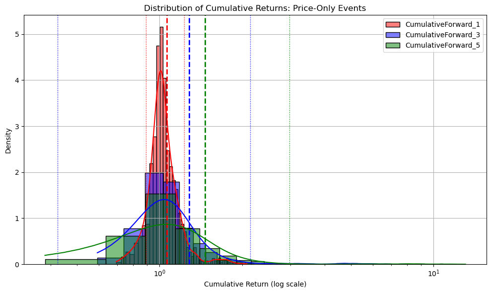

# road-to-quant
This repo documents my journey into quantitative finance through small, focused projects inspired by concepts taught in *Quantitative Portfolio Management* by Michael Isichenko.

This repository has been discontinued due to other commitments. All of my current work is private. If you'd like to see what I am up to, you can click [here](https://szyk.dev) for my personal site.

## Backstory
Although I don't come from a quantitative background, I am deeply drawn to quant finance because:
- It uses data to forecast asset prices.
- It allows me to apply my programming skills in a meaningful way.
- It represents a challenging intellectual pursuit.

On the 2nd May 2025, I bought the book *Quantitative Portfolio Management* by Michael Isichenko to begin structured learning on this journey. My earlier interest in quant finance led me to explore topics like CAPM, mean-variance optimization, and risk metrics, but mostly through self-guided experimentation in Python. While my initial understanding was limited, the tools I built — especially Drapt Analytics, an in-progress portfolio analytics tool, which can be found [here](https://github.com/szykopyc/drapt-analytics.git) — proved to be both functional and personally rewarding.

This time, my goal is to approach quant finance with both theory and practical implementation. Even if I don't end up working as a quant, I believe that intellectual curiosity is always a valuable pursuit.

Szymon Kopycinski
[LinkedIn](https://www.linkedin.com/in/szymonkopycinski)

## Chapters
- **Chapter 1: Market Data**
    - This chapter explored the different types of data, corporate actions and their adjustments, and linear vs log returns.
    - The mini-projects include 2 notebooks, one showing adjustment for corporate actions, and one for the difference between linear and log returns.
- **Chapter 2: Forecasting**
    - This chapter has so far explored data used for forecasts (e.g., event-based predictors, macroeconomic data, alternative data), as well as technical forecasts (e.g., mean reversion, momentum).
    - Mini-projects include a notebook visualising mean-reversion (noise, residuals, market beta), a simple momentum trading strategy with a backtester (negative Sharpe Ratio), and a new notebook on abnormal volume and momentum trading.
    - A notebook implementing a long-only trading strategy based on abnormal volume (z-score > 2.5) and momentum (top 10% returns) for 50 stocks (2022–2025). It backtests 1, 3, and 5-day returns, revealing modest mean returns (15–34% over 5 day long positions, for a 3 year backtest) driven by outliers (e.g., NVDA), with high skewness/kurtosis, illustrating the challenges of public signal strategies (inspired by Isichenko’s momentum frameworks).

    
    *Cumulative returns of a price-only momentum strategy, backtested on 3 years of data with varying position holding periods.*

    - This chapter is still being read, further mini-projects will be added.

## Future Plans
- Finish reading Chapter 2, complete any further projects.
- Enhance the abnormal volume and momentum notebook with risk-adjusted metrics (e.g., Sharpe ratio).

## Technologies
- Python 3.11
- Pandas, NumPy, Matplotlib, Seaborn, yfinance, SciPy, Statsmodels, scikit-learn, python-dotenv, Requests
- Jupyter Notebook
- Git

## Setup Instructions
1. Clone the repo: `git clone https://github.com/szykopyc/road-to-quant.git`
2. Install dependencies: `pip install -r requirements.txt`
3. Run scripts using Jupyter Notebook or Python where applicable:
    - Example: `jupyter notebook adjusting_for_corporate_actions.ipynb`

## Contributing
Suggestions or feedback on the projects are welcome! Please open an issue or submit a pull request with improvements. For major changes, discuss in an issue first.

## Data Access

Historical OHLCV data sourced in this project is primarily from Polygon.io, with some instances from [Yahoo Finance](https://uk.finance.yahoo.com) (`yfinance` as the proxy) when explicitly stated.

Due to redistribution purposes, the processed `.pkl` files are not included.

### How to Fetch the Data
To recreate the dataset locally:
1. Get a free Polygon.io API key from [Polygon.io](https://polygon.io)
2. Create a `.env` file in the root directory with your API key:
`POLYGON_API_KEY=your_actual_api_key_here`
3. Run the data pull script by setting the `pull_or_pickle` argument in data fetching functions to "pull"
    - Example: `data = pull_stock_data(stock, pull_or_pickle="pull")`
4. This will download and cache the data in the `data` folder in each chapter folder

Subsequent runs will load from this file automatically unless "pull" is explicitly set

## License

This project is licensed under the [MIT License](LICENSE).  
You are free to use, modify, and distribute it with proper attribution.
